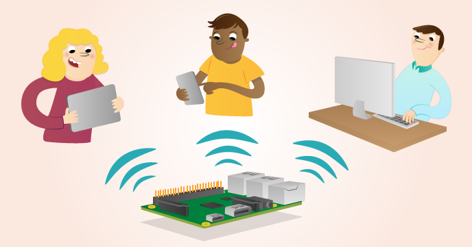

# Build a LAMP Web Server with WordPress

Set up a LAMP (Linux, Apache, MySQL & PHP) web server on your Raspberry Pi, then download and configure a WordPress site.

## Requirements

All you'll need is a Raspberry Pi with an SD card loaded with Raspbian.

The worksheet contains downloads and installations so you'll need to be online to follow the steps.

## Worksheet

- [The worksheet](worksheet.md)

## Licence

Unless otherwise specified, everything in this repository is covered by the following licence:

***LAMP Web Server with WordPress*** by the [Raspberry Pi Foundation](https://www.raspberrypi.org/) is licensed under a [Creative Commons Attribution 4.0 International Licence](http://creativecommons.org/licenses/by-sa/4.0/).

Based on a work at https://github.com/raspberrypilearning/web-server-wordpress
