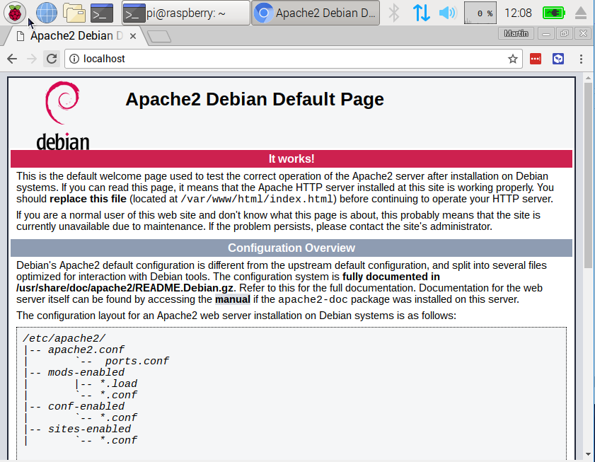

## Nastavení webového serveru Apache

Apache je populární webový server, který si můžete nainstalovat na Raspberry Pi a umožnit mu zobrazování webových stránek.

Apache sám o sobě dokáže obsluhovat HTML soubory přes HTTP. S dalšími moduly může zobrazovat dynamické webové stránky pomocí skriptovacích jazyků, jako je PHP.

### Instalace Apache

--- task ---

Otevři okno terminálu výběrem možnosti **Příslušenství** > **Terminál** z nabídky.

--- /task ---

--- task ---

Zadej do terminálu následující příkaz a stiskni <kbd>Enter</kbd> pro instalaci `apache2`

--- code ---
---
language: bash
line_numbers: false
---
sudo apt install apache2 -y

--- /code ---

**Tip:** Pokud se zobrazí chyba, ujisti se, že používáš nejnovější a aktualizovanou verzi operačního systému Raspberry Pi.

--- /task ---

### Otestuj webový server

Ve výchozím nastavení Apache umístí do webové složky testovací HTML soubor, který si budeš moci prohlížet z tvého Raspberry Pi nebo jiného počítače v síti.

--- task ---

Otevři Chromium výběrem možnosti **Internet** > **Webový prohlížeč Chromium** z nabídky.

--- /task ---

--- task ---

Do adresního řádku zadej `localhost`.

--- /task ---

Toto bys měl vidět v okně prohlížeče:

To znamená, že máš Apache funkční!

### Změna výchozí webové stránky

Tato výchozí webová stránka je pouze soubor HTML v souborovém systému. Nachází se na adrese `/var/www/html/index.html`.

--- task ---

Zadej do terminálu následující příkaz pro přechod do adresáře obsahujícího soubor HTML:

--- code ---
---
language: bash
line_numbers: false
---
cd /var/www/html

--- /code ---

--- /task ---

--- task ---

Otevři soubor `index.html` pomocí Thonny

--- code ---
---
language: bash
line_numbers: false
---
sudo thonny index.html

--- /code ---

--- /task ---

--- task ---

Smaž obsah souboru, poté napiš krátkou zprávu a ulož změny.

--- /task ---

--- task ---

Vrať se do Chromia a obnov prohlížeč. Tvá zpráva se zobrazí na webové stránce.

--- /task ---

--- collapse ---
---
title: Přístup ke stránce z jiného zařízení v síti
---

Svou webovou stránku můžete otevřít z jakéhokoli jiného počítače v síti pomocí IP adresy vašeho Raspberry Pi, např. `http://192.168.1.10`.

Chceš-li zjistit IP adresu tvého Raspberry Pi, zadej do terminálového okna `hostname -I`.

--- /collapse ---
