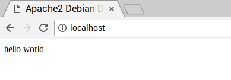

## Instalace PHP

PHP je **preprocesor**: je to kód, který se spustí, když server obdrží požadavek na webovou stránku prostřednictvím webového prohlížeče. Zjistí, co se má na stránce zobrazit, a poté tuto stránku odešle do prohlížeče.

--- task ---

Pro instalaci PHP zadej do terminálu následující příkaz:

--- code ---
---
language: bash
line_numbers: false
---
sudo apt install php -y

--- /code ---

--- /task ---

### Test PHP

--- task ---

Zadej tento příkaz pro odstranění souboru `index.html` z dřívější doby:

--- code ---
---
language: bash
line_numbers: false
---
sudo rm index.html

--- /code ---

--- /task ---

--- task ---

Vytvoř nový soubor s názvem `index.php`:

--- code ---
---
language: bash
line_numbers: false
---
sudo thonny index.php

--- /code ---

--- /task ---

--- task ---

V editoru kódu Thonny zadej tento PHP kód do souboru a ulož jej.

--- code ---
---
language: php
line_numbers: false
---
<?php echo "hello world"; ?>

--- /code ---

--- /task ---

--- task ---

Obnov prohlížeč. Měl bys vidět „ahoj světe“. Tato stránka není dynamická, ale stále je obsluhována PHP.

--- /task ---

--- collapse ---
---
title: Vidím pouze PHP kód
---
Pokud se ti místo „ahoj světe“ zobrazí nezpracované PHP, použij tento příkaz k opětovnému spuštění a restartování Apache:

--- code ---
---
language: bash
line_numbers: false
---
sudo service apache2 restart

--- /code ---

--- /collapse ---
