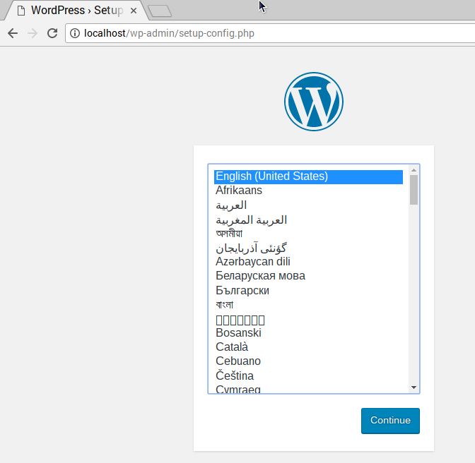

## Konfigurace WordPressu

--- task ---

Jakmile se Raspberry Pi restartuje, otevři Chromium a do adresního řádku zadej `localhost`.

Měl bys vidět stránku WordPressu s výzvou k výběru jazyka.



--- /task ---

--- task ---

Vyberte jazyk a klikněte na **Pokračovat**.

--- /task ---

Zobrazí se vám uvítací obrazovka WordPressu.


--- task ---

Klikněte na tlačítko **Jdeme na to!**.

--- /task ---

--- task ---

Nyní vyplň základní informace o webu takto: **Tip:** Ujisti se, že do prvního pole zadáš `wordpress`, protože zobrazený text je pouze návrh, pole je prázdné.

```
Database Name:      wordpress
User Name:          root
Password:           <YOUR PASSWORD>
Database Host:      localhost
Table Prefix:       wp_
```

Klikněte na **Odeslat** pro pokračování.

--- /task ---


--- task ---

Klikněte na tlačítko **Spustit instalaci**.

--- /task ---

--- task ---

Vyplňte požadované informace a poté klikněte na tlačítko `Nainstalovat WordPress`.

--- /task ---

--- task ---

Přihlas se pomocí účtu, který sis právě vytvořil.

Nyní, když jsi přihlášen a máš nastavené stránky, si je můžeš prohlédnout na adrese `http://localhost/wp-admin`.

--- /task ---


### Přátelské permalinky

Doporučuje se změnit nastavení trvalých odkazů, aby byly tvé URL adresy uživatelsky přívětivější.

--- task ---

Přihlas se do WordPressu a přejdi na dashboard.

--- /task ---

--- task ---

Jdi na **Nastavení**a poté na **Trvalé odkazy**.

--- /task ---

--- task ---

Vyber možnost **Název příspěvku** a klikni na **Uložit změny**.

--- /task ---

--- task ---

Zadej do terminálu následující příkaz, abys povolil mod `rewrite` v Apachi:

--- code ---
---
language: bash
line_numbers: false
---
sudo a2enmod rewrite

--- /code ---

--- /task ---

--- task ---

Otevři konfigurační soubor Apache

--- code ---
---
language: bash
line_numbers: false
---
sudo geany /etc/apache2/sites-available/000-default.conf

--- /code ---

--- /task ---

--- task ---

Za řádek 1 přidej následující řádky.

--- code ---
---
language: sql line_numbers: true line_number_start: 2
line_highlights: 3-5
---
<VirtualHost *:80> <Directory "> AllowOverride All </Directory>

--- /code ---

--- /task ---

--- task ---

Ulož soubor a zavři editor.

--- /task ---

--- task ---

V terminálu zadej příkaz pro restartování Apache:


--- code ---
---
language: bash
line_numbers: false
---
sudo service apache2 restart

--- /code ---

--- /task ---