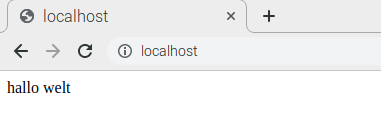

## Apache installieren

PHP is a **preprocessor**: it's code that runs when the server receives a request for a web page via a web browser. It works out what needs to be shown on the page, and then sends that page to the browser.

--- task ---

Type the following command in the terminal to install PHP:

--- code ---
---
language: bash
line_numbers: false
---
sudo apt install php -y

--- /code ---

--- /task ---

### Test PHP

--- task ---

Type this command to delete the `index.html` file from earlier:

--- code ---
---
language: bash
line_numbers: false
---
sudo rm index.html

--- /code ---

--- /task ---

--- task ---

Create a new file called `index.php`:

--- code ---
---
language: bash
line_numbers: false
---
sudo thonny index.php

--- /code ---

--- /task ---

--- task ---

In the Thonny code editor, type this PHP code into the file and save it.

--- code ---
---
language: php
line_numbers: false
---
<?php echo "hello world"; ?>

--- /code ---

--- /task ---

--- task ---

Refresh your browser. You should see "hello world". This page is not dynamic, but it is still served by PHP.

--- /task ---

--- collapse ---
---
title: I can only see PHP code
---
If you see the raw PHP above instead of "hello world", use this command to reload and restart Apache:

--- code ---
---
language: bash
line_numbers: false
---
sudo service apache2 restart

--- /code ---

--- /collapse ---
