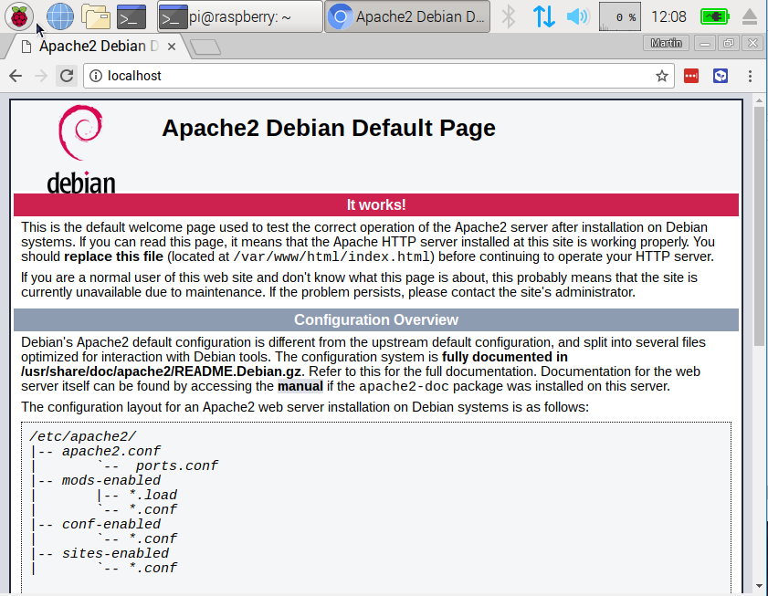

## Richte einen Apache Webserver ein

Apache ist eine beliebte Webserveranwendung, die du auf dem Raspberry Pi installieren kannst, damit er Webseiten bereitstellen kann.

Apache kann selbstständig HTML-Dateien über HTTP bereitstellen. Mit zusätzlichen Modulen kann es dynamische Webseiten mit Skriptsprachen wie PHP bereitstellen.

### Apache installieren

+ Öffne ein Terminal-Fenster, indem du im Menü **Zubehör** > **Terminal** auswählst.

+ Installiere das `apache2` Paket, indem du den folgenden Befehl in das Terminal tippst und dann <kbd>Enter<kbd> drückst:
</li> </ul> 
  
  <pre><code class="bash">sudo apt-get install apache2 -y
</code></pre>
  
  

    
  

<h3 spaces-before="0">
  Teste den Webserver
</h3>

  Standardmäßig legt Apache eine Test-HTML-Datei in den Web-Ordner, die du von deinem Pi oder einem anderen Computer in deinem Netzwerk ansehen kannst.

  Öffne die Apache-Standard-Website auf deinem Raspberry Pi:

<ul>
  <li>
    

      Öffne Chromium, indem du <strong x-id="1">Internet</strong> > <strong x-id="1">Chromium-Webbrowser</strong> vom Menü auswählst.
    

  </li>
  <li>
    

      Gib die Adresse <code>http://localhost</code> ein.
    

  </li>
</ul>

  Du solltest folgendes in deinem Browser-Fenster sehen:

  

  Das heißt, dass dein Apache funktioniert!

  Du kannst diese Website auch von jedem anderen Computer in deinem Netzwerk öffnen, indem du die IP-Adresse deines Raspberry Pi verwendest, z.B.: <code>http://192.168.1.10</code>.

  Um die IP-Adresse deines Raspberry Pi herauszufinden, tippe <code>hostname -I</code> in das Terminal-Fenster.  Die <a href="https://www.raspberrypi.org/documentation/remote-access/ip-address.md">IP-Adresse</a> deines Raspberry Pi ist wirklich nützlich und ermöglicht es dir aus der Ferne darauf zuzugreifen.

<h3 spaces-before="0">
  Die Standard-Website ändern
</h3>

  Diese Standard-Website ist nur eine HTML-Datei im Dateisystem. Sie befindet sich in <code>/var/www/html/index.html</code>.

<ul>
  <li>
    Navigiere im Terminal zu diesem Verzeichnis und schau was sich darin befindet:
  </li>
</ul>

<pre><code>cd /var/www/html
ls -al
</code></pre>

  Du solltest folgendes im Fenster sehen:

<pre><code class="bash">total 12
drwxr-xr-x  2 root root 4096 Jan  8 01:29 .
drwxr-xr-x  3 root root 4096 Jan  8 01:28 ..
-rw-r--r--  1 root root  177 Jan  8 01:29 index.html
</code></pre>

  Das zeigt, dass sich in <code>/var/www/html/</code> eine Datei namens <code>index.html</code> befindet. <code>.</code> verweist auf das Verzeichnis selbst <code>/var/www/html</code> und <code>..</code> verweist auf das Eltern-Verzeichnis <code>/var/www/</code>.

<h3 spaces-before="0">
  Was die Spalten bedeuten
</h3>

<ol start="1">
  <li>
    Die Berechtigungen der Datei oder des Verzeichnisses
  </li>
  
  <li>
    Die Anzahl an Dateien im Verzeichnis (oder <code>1</code> falls es eine Datei ist).
  </li>
  
  <li>
    Der Benutzer, der die Datei oder das Verzeichnis besitzt
  </li>
  
  <li>
    Die Gruppe, die die Datei oder das Verzeichnis besitzt
  </li>
  
  <li>
    Die Größe der Datei oder des Verzeichnisses
  </li>
  
  <li>
    Das Datum und die Zeit der letzten Änderung
  </li>
</ol>

  Wie du siehst, gehören das Verzeichnis <code>html</code> und die Datei <code>index.html</code> beide dem <code>root</code>-Benutzer, also musst du <code>sudo</code> nutzen um sie zu bearbeiten

  Du kannst diese Datei mit leafpad bearbeiten:

<pre><code class="bash">sudo leafpad index.html
</code></pre>

  Wenn du die Datei änderst, speichere sie und lade den Browser neu, damit die Änderungen sichtbar werden.

