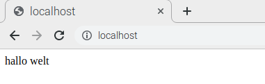

## Installiere PHP

PHP ist ein **Präprozessor**: Es ist Code der ausgeführt wird, wenn der Server eine Anforderung für eine Webseite über einen Webbrowser empfängt. Es ermittelt, was auf der Seite angezeigt werden soll und sendet diese Seite dann an den Browser. Im Gegensatz zu statischem HTML kann PHP unter verschiedenen Umständen unterschiedliche Inhalte anzeigen. Andere Sprachen sind ebenfalls dazu in der Lage, aber da WordPress in PHP geschrieben ist, müssen wir es diesmal verwenden. PHP ist eine sehr beliebte Sprache im Web: Große Projekte wie Facebook und Wikipedia sind in PHP geschrieben.

+ Installiere das PHP-Paket mit dem folgenden Befehl:

```bash
sudo apt-get install php -y
```

### Teste PHP

+ Erstelle die Datei `index.php`:

```bash
sudo mousepad index.php
```

+ Füge einige PHP-Inhalte ein:

```php
<?php echo "Hallo Welt"; ?>
```

+ Speichere die Datei.

+ Lösche `index.html`, weil es Vorrang vor `index.php` hat:

```bash
sudo rm index.html
```

Aktualisiere deinen Browser. Du solltest "Hallo Welt" sehen. Diese Seite ist nicht dynamisch, wird aber dennoch von PHP bereitgestellt.



Falls du den unverarbeiteten PHP-Inhalt von oben siehst, anstatt "Hallo Welt", lade und starte Apache wie folgt neu:

```bash
sudo service apache2 restart
```

+ Bearbeite `index.php` um einige dynamische Inhalte hinzuzufügen, zum Beispiel:

```php
<?php echo date('Y-m-d H:i:s'); ?>
```

Oder zeige deine PHP-Informationen:

```php
<?php phpinfo(); ?>
```
