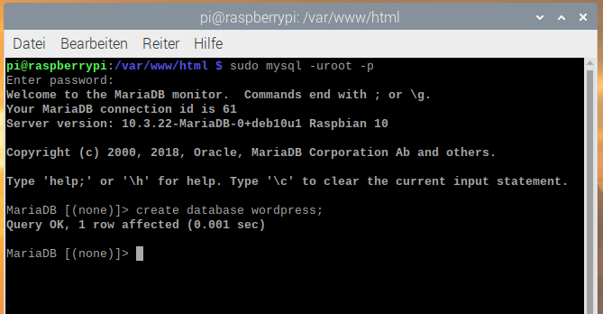

## Richte deine WordPress Datenbank ein

#### Richte MySQL/MariaDB ein

Um deine WordPress-Seite einrichten zu können, brauchst du eine Datenbank. Hier kommen MySQL und MariaDB ins Spiel!

+ Führe den Befehl zur sicheren Installation von MySQL im Terminal-Fenster aus.

```bash
sudo mysql_secure_installation
```

+ Du wirst gefragt, das aktuelle Passwort für den root-Nutzer einzugeben (`Enter current password for root (enter for none):`) — drücke **Enter**.

+ Gib **Y** (für Yes, also Ja) ein und drücke **Enter**, um das root-Passwort zu setzen (`Set root password?`).

+ Gib nach der Eingabeaufforderung `New password:` ein Passwort ein und drücke **Enter**. **Wichtig:** Merke dir dieses root-Passwort, da du es später brauchen wirst um WordPress einzurichten.

+ Gib **Y** ein, um den Anonymen-Benutzer zu entfernen (`Remove anonymous users`).

+ Gib **Y**, um Root-Anmeldungen aus der Ferne zu verbieten (`Disallow root login remotely`).

+ Gib **Y** ein, um die Testdatenbank und den Zugriff darauf zu entfernen (`Remove test database and access to it`).

+ Gib **Y** ein, um die Berechtigungstabelle neu zu laden (`Reload privilege tables now`).

Wenn alles fertig ist, wirst du die Nachricht `All done!` ("Alles fertig!") und `Thanks for using MariaDB!` ("Danke, dass du MariaDB nutzt!") sehen.

#### Erstelle die WordPress-Datenbank

+ Führe `mysql` im Terminalfenster aus:

```bash 
sudo mysql -uroot -p
```

+ Gib das von dir erstellte Root-Passwort ein.

Du wirst von der Nachricht `Welcome to the MariaDB monitor` ("Willkommen beim MariaDB Monitor") begrüßt.

+ Erstelle eine Datenbank für deine WordPress-Installation in der `MariaDB [(none)]>`-Eingabeaufforderung mit folgendem Befehl:

```
create database wordpress;
```

  Beachte das Semikolon, das die Anweisung beendet.

Wenn das geklappt hat, solltest du Folgendes sehen:

```
Query OK, 1 row affected (0.00 sec)
```



+ Gewähre dem Root-Benutzer nun Datenbankberechtigungen. **Hinweis:** Nach `IDENTIFIED BY` musst du dein eigenes Passwort eingeben.

```
GRANT ALL PRIVILEGES ON wordpress.* TO 'root'@'localhost' IDENTIFIED BY 'DEINPASSWORT';
```

+ Damit die Änderungen wirksam werden, musst du deine Datenbank-Berechtigungen neu in den Arbeitsspeicher laden:

```
FLUSH PRIVILEGES;
```

+ Exit the MariaDB prompt with <kbd>Ctrl</kbd> + <kbd>D</kbd>.

+ Restart your Raspberry Pi:

```
sudo reboot
```
