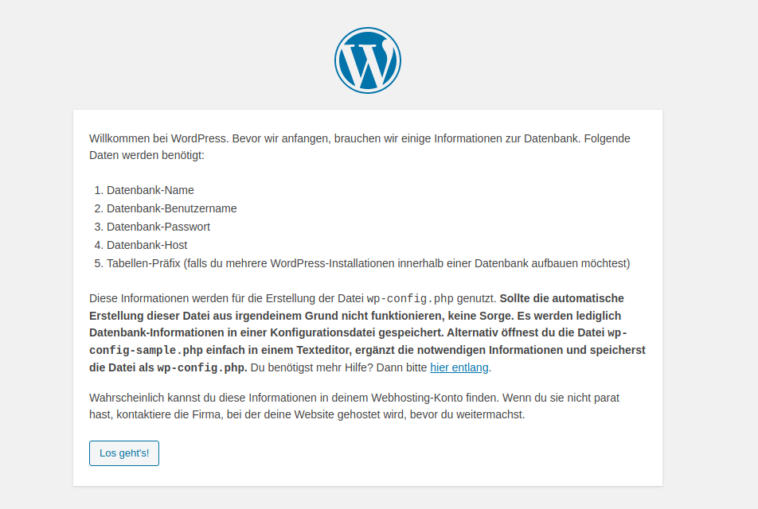
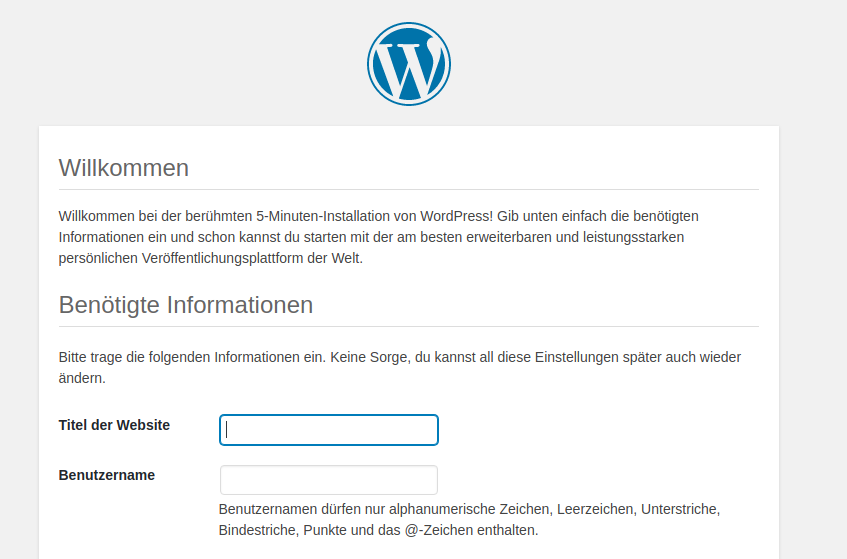
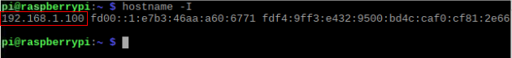

## WordPress Einstellungen

+ Öffne den Webbrowser auf deinem Pi und gehe zu `http://localhost`. Du solltest eine WordPress-Seite sehen, die dich auffordert, deine Sprache auszuwählen.


+ Wähle deine Sprache aus und klicke auf **Fortfahren**.

Dir wird der WordPress-Begrüßungsbildschirm angezeigt.



+ Klicke auf **Los geht's!**.

+ Fülle nun die grundlegenden Informationen wie folgt aus:

```
Datenbank-Name:      wordpress
Benutzername:          root
Passwort:           <YOUR PASSWORD>
Datenbank-Host:      localhost
Tabellen-Präfix:       wp_
```

+ Klicke auf **Senden** um fortzufahren.

+ Klicke auf den Button **Installation durchführen**.

Jetzt kommst du der Sache näher!



Fülle die Informationen aus: Gib deiner Seite einen Titel, erstelle einen Benutzernamen und ein Passwort und gib deine Email-Adresse ein. Klicke auf die Schaltfläche `WordPress installieren` und melde dich mit dem gerade erstellten Konto an.

Nachdem du angemeldet bist und deine Website eingerichtet hast, kannst du die Website sehen indem du `http://localhost/wp-admin` besuchst.

--- collapse ---
---
title: Melde dich von einem anderen Computer aus bei WordPress an
---

Um dich von einem anderen Computer anzumelden, öffne einen Browser und gehe zu `http://PI-IP-ADRESSE/wp-admin`, indem du die IP-Adresse deines Pi's verwendest.

Du kannst die IP-Adresse deines Pi's herausfinden, indem du diesen Befehl verwendest:

```bash
hostname -I
```



--- /collapse ---


### Freundliche Permalinks

Es wird empfohlen deine Permalink-Einstellungen zu ändern, um deine URLs benutzerfreundlicher zu gestalten.

Melde dich dazu bei WordPress an und rufe das Dashboard auf.

+ Gehe zu **Einstellungen**, dann **Permalinks**.

+ Wähle die Option **Beitragsname** und klicke auf **Änderungen speichern**.

Du wirst Apaches `rewrite`-Modul aktivieren müssen:

```bash
sudo a2enmod rewrite
```

Du wirst außerdem dem virtuellen Host (engl.: "Gastgeber"), der die Seite bereitstellt, mitteilen müssen, dass er Nachfragen überschreiben darf.

+ Bearbeite die Apache-Konfigurationsdatei für deinen virtuellen Host:

```bash
sudo leafpad /etc/apache2/sites-available/000-default.conf
```

+ Füge die folgenden Zeilen nach Zeile 1 hinzu.

```
<Directory "/var/www/html">
    AllowOverride All
</Directory>
```

- Stelle sicher dass es innerhalb von `<VirtualHost *:80>` steht, wie hier:

```
<VirtualHost *:80>
    <Directory "/var/www/html">
        AllowOverride All
    </Directory>
    ...
```

+ Speichere die Datei und schließe sie.

+ Starte Apache neu.

```bash
sudo service apache2 restart
```

### Anpassung

WordPress ist sehr anpassbar. Indem du auf den Seitennamen im WordPress-Banner oben auf der Seite klickst (wenn du angemeldet bist), wirst du zum Dashboard gebracht. Von dort aus kannst du das Theme ändern, Seiten und Beiträge hinzufügen, das Menü anpassen, Plugins hinzufügen und noch vieles mehr machen. Dies ist nur ein Vorgeschmack darauf, wie du etwas Interessantes auf dem Webserver des Raspberry Pi einrichten kannst.
