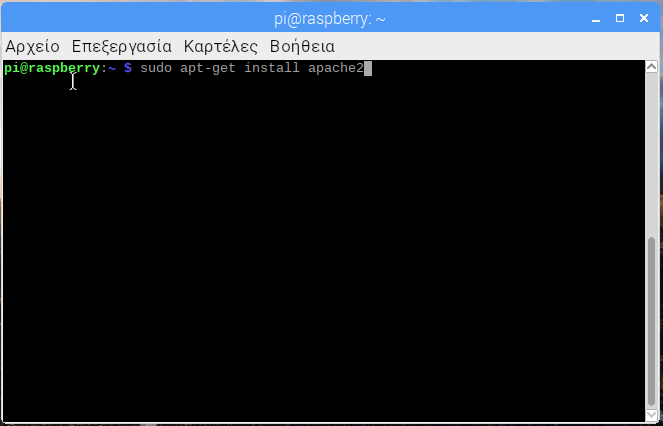

## Ρύθμισε ένα διακομιστή ιστού Apache

Ο Apache είναι μια δημοφιλής εφαρμογή διακομιστή ιστού που μπορείς να εγκαταστήσεις στο Raspberry Pi για να επιτρέψεις την προβολή ιστοσελίδων.

Από μόνος του ο Apache μπορεί να εξυπηρετεί αρχεία HTML μέσω HTTP. Με πρόσθετα αρθρώματα μπορεί να εξυπηρετήσει δυναμικές ιστοσελίδες χρησιμοποιώντας γλώσσες δέσμης ενεργειών όπως η PHP.

### Install Apache

+ Άνοιξε ένα παράθυρο τερματικού επιλέγοντας **Εργαλεία** > **Τερματικό** από το μενού.

+ Εγκατέστησε το πακέτο `apache2` πληκτρολογώντας την ακόλουθη εντολή στο τερματικό και πάτησε <kbd>Enter<kbd>:
</li></ul> 
  
  <pre><code class="bash">sudo apt-get install apache2 -y
</code></pre>
  
  

    
  

<h3 spaces-before="0">
  Δοκίμασε τον διακομιστή ιστού
</h3>

  Από προεπιλογή, ο Apache τοποθετεί ένα δοκιμαστικό αρχείο HTML στο φάκελο ιστού που θα μπορείς να δεις από το Pi ή από άλλον υπολογιστή στο δίκτυό σου.

  Άνοιξε την προεπιλεγμένη ιστοσελίδα του Apache στο Raspberry Pi:

<ul>
  <li>
    

      Άνοιξε το Chromium επιλέγοντας <strong x-id="1">Διαδίκτυο</strong> > <strong x-id="1">Πρόγραμμα περιήγησης ιστού Chromium</strong> από το μενού.
    

  </li>
  <li>
    

      Πληκτρολόγησε τη διεύθυνση <code>http://localhost</code>.
    

  </li>
</ul>

  Θα πρέπει να δεις αυτό στο παράθυρο του προγράμματος περιήγησής σου:

  

  Αυτό σημαίνει ότι ο Apache λειτουργεί!

  Θα μπορείς επίσης να ανοίξεις αυτήν την ιστοσελίδα από οποιονδήποτε άλλο υπολογιστή στο δίκτυό σου χρησιμοποιώντας τη διεύθυνση IP του Raspberry Pi, π.χ. <code>http://192.168.1.10</code>.

  Για να μάθεις τη διεύθυνση IP του Raspberry Pi, πληκτρολόγησε στο παράθυρο του τερματικού την εντολή <code>hostname -I</code>.  Η <a href="https://www.raspberrypi.org/documentation/remote-access/ip-address.md">διεύθυνση IP</a> του Raspberry Pi είναι πραγματικά χρήσιμη και θα σου επιτρέψει να έχεις απομακρυσμένη πρόσβαση σε αυτό.

<h3 spaces-before="0">
  Άλλαξε την προεπιλεγμένη ιστοσελίδα
</h3>

  Αυτή η προεπιλεγμένη ιστοσελίδα είναι απλώς ένα αρχείο HTML στο σύστημα αρχείων. Βρίσκεται στη διεύθυνση <code>/var/www/html/index.html</code>.

<ul>
  <li>
    Μετακινήσου σε αυτόν τον κατάλογο στο τερματικό και ρίξε μια ματιά στο εσωτερικό του:
  </li>
</ul>

<pre><code>cd /var/www/html
ls -al
</code></pre>

  Θα πρέπει να το δείς αυτό στο παράθυρο:

<pre><code class="bash">total 12
drwxr-xr-x  2 root root 4096 Jan  8 01:29 .
drwxr-xr-x  3 root root 4096 Jan  8 01:28 ..
-rw-r--r--  1 root root  177 Jan  8 01:29 index.html
</code></pre>

  Αυτό δείχνει ότι υπάρχει ένα αρχείο στον κατάλογο <code>/var/www/html/</code> που ονομάζεται <code>index.html</code>. Η <code>.</code>αναφέρεται στον ίδιο τον κατάλογο <code>/var/www/html</code> και οι <code>..</code> αναφέρονται στον γονικό κατάλογο <code>/var/www/</code>.

<h3 spaces-before="0">
  Τι σημαίνουν οι στήλες
</h3>

<ol start="1">
  <li>
    Τα δικαιώματα του αρχείου ή του καταλόγου
  </li>
  
  <li>
    Ο αριθμός των αρχείων στον κατάλογο (ή <code>1</code> αν είναι αρχείο).
  </li>
  
  <li>
    Ο χρήστης που έχει κυριότητα του αρχείου ή του καταλόγου
  </li>
  
  <li>
    Η ομάδα που έχει κυριότητα του αρχείου ή του καταλόγου
  </li>
  
  <li>
    Το μέγεθος του αρχείου ή του καταλόγου
  </li>
  
  <li>
    Η ημερομηνία και η ώρα της τελευταίας τροποποίησης
  </li>
</ol>

  Όπως μπορείς να δεις, ο κατάλογος <code>html</code> και το αρχείο <code>index.html</code> ανήκουν και τα δύο στον χρήστη <code>root</code>, οπότε θα πρέπει να χρησιμοποιήσεις την εντολή <code>sudo</code> για να τα επεξεργαστείς.

  Μπορείς να επεξεργαστείς αυτό το αρχείο με τη χρήση του προγράμματος leafpad:

<pre><code class="bash">sudo leafpad index.html
</code></pre>

  Εάν κάνεις μια αλλαγή στο αρχείο, αποθήκευσέ το και κάνε ανανέωση στο πρόγραμμα περιήγησης, ώστε να δεις να εμφανίζεται η αλλαγή σου.

