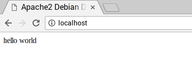

## Εγκατέστησε την PHP

Η PHP είναι ένας **προ-επεξεργαστής**: ο κώδικάς της εκτελείται όταν ο διακομιστής λαμβάνει ένα αίτημα για μια ιστοσελίδα μέσω ενός προγράμματος περιήγησης ιστού. Υπολογίζει τι πρέπει να εμφανίζεται στη σελίδα και στη συνέχεια στέλνει τη σελίδα στο πρόγραμμα περιήγησης. Σε αντίθεση με το στατικό αρχείο HTML, η PHP μπορεί να εμφανίζει διαφορετικό περιεχόμενο κάτω από  διαφορετικές συνθήκες. Και άλλες γλώσσες είναι επίσης ικανές να το κάνουν αυτό, αλλά επειδή το WordPress είναι γραμμένο σε PHP, αυτήν πρέπει να χρησιμοποιήσουμε αυτή τη φορά. Η PHP είναι μια πολύ δημοφιλής γλώσσα στον Ιστό: τεράστια έργα όπως το Facebook και η Wikipedia είναι γραμμένα με PHP.

+ Εγκατέστησε το πακέτο PHP με την ακόλουθη εντολή:

```bash
sudo apt-get install php -y
```

### Δοκίμασε την PHP

+ Δημιούργησε το αρχείο `index.php`:

```bash
sudo leafpad index.php
```

+ Βάλε λίγο περιεχόμενο PHP μέσα στο αρχείο:

```php
<?php echo "hello world"; ?>
```

+ Αποθήκευσε το αρχείο.

+ Διέγραψε το αρχείο `index.html`, επειδή υπερισχύει του `index.php`:

```bash
sudo rm index.html
```

Κάνε ανανέωση στο πρόγραμμα περιήγησής σου. Θα πρέπει να δεις «hello world». Αυτή η σελίδα δεν είναι δυναμική, αλλά εξακολουθεί να εξυπηρετείται από την PHP.



Εάν βλέπεις τον παραπάνω (ακατέργαστο) κώδικα PHP αντί για το «hello world», φόρτωσε ξανά και επανεκκίνησε τον Apache με την εντολή:

```bash
sudo service apache2 restart
```

+ Επεξεργάσου το αρχείο `index.php` για να συμπεριλάβεις κάποιο δυναμικό περιεχόμενο, για παράδειγμα:

```php
<?php echo date('Y-m-d H:i:s'); ?>
```

Ή δείξε τις πληροφορίες της PHP σου:

```php
<?php phpinfo(); ?>
```
