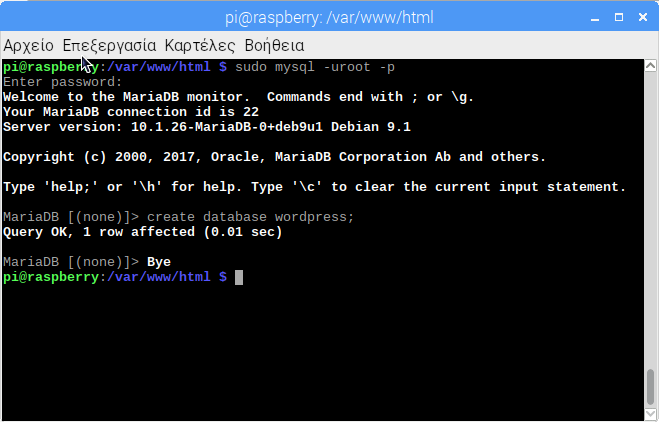

## Ρύθμισε την βάση δεδομένων του WordPress

#### Ρύθμισε την MySQL/MariaDB

Για να ρυθμίσεις τον ιστότοπό σου στο WordPress, χρειάζεσαι μια βάση δεδομένων. Εδώ έρχονται η MySQL και η MariaDB!

+ Εκτέλεσε την εντολή ασφαλούς εγκατάστασης MySQL στο παράθυρο τερματικού.

```bash
sudo mysql_secure_installation
```

+ Θα σου ζητηθεί `Εισαγάγετε το τρέχον συνθηματικό για το root (πατήστε enter για κανένα):` - πάτησε **Enter**.

+ Πληκτρολόγησε **Y** και πάτησε **Enter** στο `Set root password?`.

+ Πληκτρολόγησε ένα συνθηματικό στην γραμμή εντολών στο `New password:` και πάτησε **Enter**. **Σημαντικό:** θυμήσου αυτό το συνθηματικό του root, καθώς θα το χρειαστείς αργότερα για να ρυθμίσεις το WordPress.

+ Πληκτρολόγησε **Y** για την `Κατάργηση ανώνυμων χρηστών`.

+ Πληκτρολόγησε **Y** για την `Απαγόρευση απομακρυσμένης σύνδεσης root`.

+ Πληκτρολόγησε **Y** για `Κατάργηση δοκιμαστικής βάσης δεδομένων και πρόσβασης σε αυτήν`.

+ Πληκτρολόγησε **Y** για `Επαναφόρτωση των πινάκων προνομίων τώρα`.

Όταν ολοκληρωθεί, θα δεις τα μηνύματα `All done!` και `Thanks for using MariaDB!`.

#### Δημιούργησε τη βάση δεδομένων του WordPress

+ Εκτέλεσε την εντολή `mysql` στο παράθυρο τερματικού:

```bash 
sudo mysql -uroot -p
```

+ Γράψε το συνθηματικό του root που δημιούργησες.

Θα σε υποδεχτεί με το μήνυμα `Welcome to the MariaDB monitor`.

+ Δημιούργησε τη βάση δεδομένων για την εγκατάσταση του WordPress στην γραμμή εντολών `MariaDB [(none)]>` χρησιμοποιώντας την εντολή:

```
create database wordpress;
```

  Σημείωσε το ερωτηματικό στο τέλος της δήλωσης.

Εάν αυτό ήταν επιτυχές, θα πρέπει να δεις αυτό:

```
Query OK, 1 row affected (0.00 sec)
```



+ Τώρα παραχώρησε δικαιώματα της βάσης δεδομένων στο χρήστη root. **Σημείωση:** θα πρέπει να εισάγεις το δικό σου συνθηματικό μετά από την εντολή `IDENTIFIED BY`.

```
GRANT ALL PRIVILEGES ON wordpress.* TO 'root'@'localhost' IDENTIFIED BY 'YOURPASSWORD';
```

+ Για να εφαρμοστούν οι αλλαγές, θα πρέπει να εκκαθαρίσεις τα δικαιώματα της βάσης δεδομένων:

```
FLUSH PRIVILEGES;
```

+ Exit the MariaDB prompt with <kbd>Ctrl</kbd> + <kbd>D</kbd>.

+ Restart your Raspberry Pi:

```
sudo reboot
```
