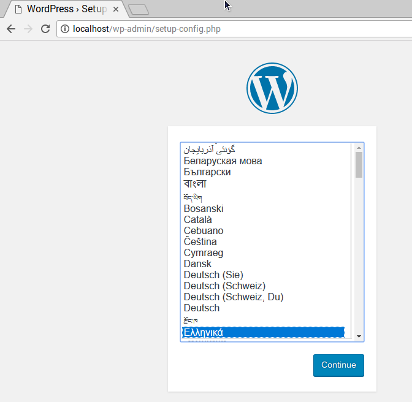
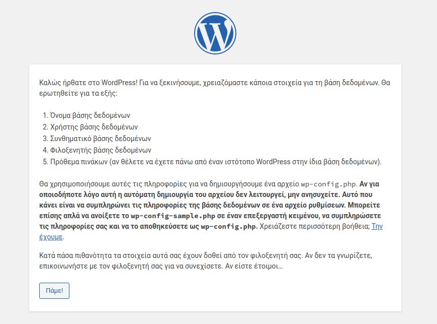
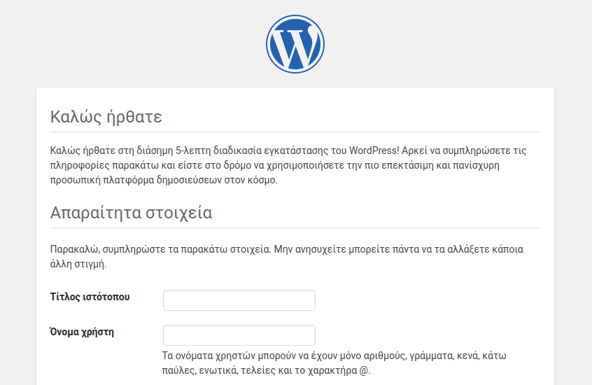

## Διαμόρφωση του WordPress

+ Άνοιξε το πρόγραμμα περιήγησης ιστού στο Pi σου και μετακινήσου στη σελίδα `http://localhost`, όπου θα πρέπει να δεις μια σελίδα WordPress που  ζητά να επιλέξεις τη γλώσσα σου.



+ Επέλεξε τη γλώσσα σου και κάνε κλικ στο **Continue**.

Θα εμφανιστεί η οθόνη καλωσορίσματος του WordPress.



+ Κάνε κλικ στο κουμπί **Πάμε!**.

+ Τώρα συμπλήρωσε τις βασικές πληροφορίες του ιστότοπου ως εξής:

```
Όνομα βάσης δεδομένων: wordpress
Όνομα χρήστη: root
Κωδικός πρόσβασης: <YOUR PASSWORD>
Κεντρικός υπολογιστής βάσης δεδομένων: localhost
Πρόθεμα πίνακα: wp_
```

+ Κάνε κλικ στο **Υποβολή** για να προχωρήσει.

+ Κάνε κλικ στο κουμπί **Εκτέλεση εγκατάστασης**.

Κοντεύεις!



Συμπλήρωσε τις πληροφορίες: δώσε έναν τίτλο στον ιστότοπό σου, δημιούργησε ένα όνομα χρήστη και ένα συνθηματικό και γράψε την ηλεκτρονική σου διεύθυνση. Πάτα το κουμπί `Εγκατάσταση WordPress` και στη συνέχεια  κάνε σύνδεση χρησιμοποιώντας τον λογαριασμό που μόλις δημιούργησες.

Τώρα που έχεις συνδεθεί και έχεις ρυθμίσει τον ιστότοπό σου, μπορείς να δεις τον ιστότοπο μεταβαίνοντας στο `http://localhost/wp-admin`.

--- collapse ---

---
title: Κάνε είσοδο στο WordPress από άλλον υπολογιστή
---

Για να συνδεθείς από έναν άλλο υπολογιστή, άνοιξε ένα πρόγραμμα περιήγησης και εισήγαγε τη διεύθυνση `http://PI-IP-ADDRESS/wp-admin`, χρησιμοποιώντας τη διεύθυνση IP του Pi σου.

Μπορείς να βρεις τη διεύθυνση IP του Pi χρησιμοποιώντας αυτήν την εντολή:

```bash
hostname -I
```


--- /collapse ---


### Φιλικοί σύνδεσμοι

Συνιστάται να αλλάξεις τις ρυθμίσεις μόνιμου συνδέσμου για να κάνεις τις διευθύνσεις URL πιο φιλικές.

Για να το κάνεις αυτό, συνδέσου στο WordPress και μετακινήσου στον πίνακα ελέγχου.

+ Μετακινήσου στις **Ρυθμίσεις** και μετά στο **Μόνιμοι σύνδεσμοι**.

+ Επέλεξε το **Όνομα ανάρτησης** και κάνε κλικ στο **Αποθήκευση αλλαγών**.

Θα πρέπει να ενεργοποιήσεις την κατάσταση `επανεγγραφή` του Apache με την εντολή:

```bash
sudo a2enmod rewrite
```

Θα πρέπει επίσης να ενημερώσεις τον εικονικό υπολογιστή που εξυπηρετεί τον ιστότοπο για να επιτρέψει την αντικατάσταση αιτημάτων.

+ Επεξεργάσου το αρχείο ρυθμίσεων του Apache για τον εικονικό υπολογιστή σου:

```bash
sudo mousepad /etc/apache2/sites-available/000-default.conf
```

+ Πρόσθεσε τις ακόλουθες γραμμές μετά τη γραμμή 1.

```
<Directory "/var/www/html">
    AllowOverride All
</Directory>
```

- Βεβαιωθείτε ότι είναι εντός του `<VirtualHost *:80>` ως εξής:

```
<VirtualHost *:80>
    <Directory "/var/www/html">
        AllowOverride All
    </Directory>
    ...
```

+ Αποθήκευσε το αρχείο και αποχώρησε.

+ Κάνε επανεκκίνηση στον Apache.

```bash
sudo service apache2 restart
```

### Προσαρμογή

Το WordPress είναι πολύ προσαρμόσιμο. Κάνοντας κλικ στο όνομα του ιστότοπού σου στην μπάρα του WordPress στο επάνω μέρος της σελίδας (όταν είσαι συνδεδεμένος), θα μεταφερθείς στον Πίνακα ελέγχου. Από εκεί, μπορείς να αλλάξεις το θέμα, να προσθέσεις σελίδες και δημοσιεύσεις, να επεξεργαστείς το μενού, να προσθέσεις πρόσθετα και πολλά άλλα. Αυτό είναι απλώς δοκιμαστικό για να δημιουργήσεις κάτι ενδιαφέρον στον διακομιστή ιστού του Raspberry Pi.
