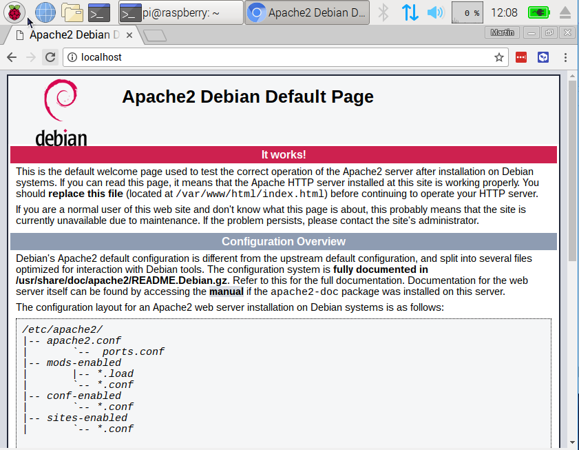

## Set up Apache Web Server

Apache is a popular web server application you can install on the Raspberry Pi to allow it to serve web pages.

On its own, Apache can serve HTML files over HTTP, and with additional modules can serve dynamic web pages using scripting languages such as PHP.

### Install Apache

+ Open a terminal by selecting `Accessories`, `Terminal` from the menu.

+ Install the `apache2` package by typing the following command into the terminal and pressing Enter:

```bash
sudo apt-get install apache2 -y
```


### Test the web server

By default, Apache puts a test HTML file in the web folder, which you will be able to view from your Pi or another computer on your network. 

Open the Apache default web page on your Raspberry Pi:

+ Open Chromium by selecting `Internet`, `Chromium Web Browser` from the menu.

+ Enter the address `http://localhost`.  



This means you have Apache working!

You will also be able to open this web page from any other computer on your network, using the ip address of your Raspberry Pi e.g. `http://192.168.1.10`.

To find out your Raspberry Pi's IP address, type `hostname -I` in the terminal.  Your Raspberry Pi's [IP address](https://www.raspberrypi.org/documentation/remote-access/ip-address.md) is a really useful and will allow you to remotely access it.


### Changing the default web page

This default web page is just a HTML file on the filesystem. It is located at `/var/www/html/index.html`.

Navigate to this directory in the Terminal and have a look at what's inside:

```
cd /var/www/html
ls -al
```

This will show you:

```bash
total 12
drwxr-xr-x  2 root root 4096 Jan  8 01:29 .
drwxr-xr-x  3 root root 4096 Jan  8 01:28 ..
-rw-r--r--  1 root root  177 Jan  8 01:29 index.html
```

This shows that there is one file in `/var/www/html/` called `index.html`. The `.` refers to the directory itself `/var/www/html` and the `..` refers to the parent directory `/varwww/`.

### What the columns mean

- The permissions of the file or directory
2. The number of files in the directory (or `1` if it's a file).
3. The user which owns the file or directory
4. The group which owns the file or directory
5. The file size
6. The last modification date & time

As you can see, by default the `html` directory and `index.html` file are both owned by the `root` user, so you'll need to use `sudo` to edit them.

You can edit this file using nano:

```bash
sudo leafpad index.html
```

If you make a change to the html, save it and refresh the browser you will see your change appear.

