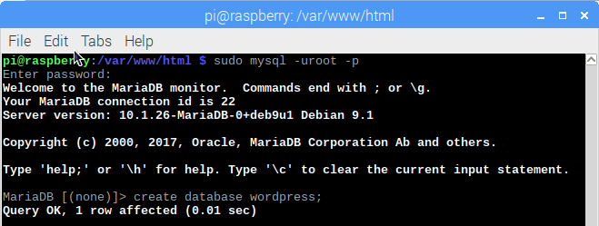

## Set up your WordPress Database

### Setup MySQL / MariaDB

To get your WordPress site set up, you need a database. 

+ Run the MySQL secure installation command in the terminal.

```bash
sudo mysql_secure_installation
```

+ You will be asked `Enter current password for root (enter for none):`, press Enter.

+ Type `Y` and press Enter to `Set root password?`.

+ Enter a password at the `New password:` prompt and press Enter.

Remember your root password as you will need it later to setup WordPress.

+ Enter `Y` to `Remove anonymous users`.

+ Enter `Y` to `Disallow root login remotely`.

+ Enter `Y` to `Remove test database and access to it`.

+ Enter `Y` to `Reload privilege tables now`.

When complete you will see the message `All done!` and `Thanks for using MariaDB!`.

### Create the WordPress database

+ Run `mysql` in the Terminal

```bash 
sudo mysql -uroot -p
```

+ Enter the root password you setup.

You will be greeted by the message `Welcome to the MariaDB monitor`.

+ Create the database for your WordPress installation at the `MariaDB [(none)]>` prompt using:

```
create database wordpress;
```

Note the semi-colon ending the statement. 

On success you should see:

```
Query OK, 1 row affected (0.00 sec)
```



+ Grant database privileges to the root user. **You will need to enter your own password after** ***IDENTIFIED BY***.

```
GRANT ALL PRIVILEGES ON wordpress.* TO 'root'@'localhost' IDENTIFIED BY 'YOURPASSWORD';
```

+ Flush the database privileges:

```
FLUSH PRIVILEGES;
```

+ Exit out of the MariaDB prompt with `Ctrl + D`.

