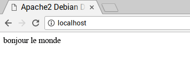

## Installer PHP

PHP est un **préprocesseur** : c'est du code qui s'exécute lorsque le serveur reçoit une demande de page Web via un navigateur Web. Il détermine ce qui doit être affiché sur la page, puis envoie cette page au navigateur. Contrairement à l'HTML statique, PHP peut afficher différents contenus dans différentes circonstances. D'autres langages sont également capables de le faire, mais comme WordPress est écrit en PHP, c'est ce que nous devons utiliser cette fois. PHP est un langage très populaire sur le Web : d'énormes projets comme Facebook et Wikipedia sont écrits en PHP.

+ Installe le paquet PHP avec la commande suivante :

```bash
sudo apt-get install php -y
```

### Teste PHP

+ Crée le fichier `index.php` :

```bash
sudo leafpad index.php
```

+ Mets du contenu PHP dedans :

```php
<?php echo "bonjour le monde"; ?>
```

+ Enregistre le fichier.

+ Supprime `index.html` , car il a priorité sur `index.php` :

```bash
sudo rm index.html
```

Actualise ton navigateur. Tu devrais voir « bonjour le monde ». Cette page n'est pas dynamique, mais elle est toujours desservie par PHP.



Si tu vois le PHP brut ci-dessus au lieu de « bonjour le monde », recharge et redémarre Apache comme ceci :

```bash
sudo service apache2 restart
```

+ Modifie `index.php` pour inclure du contenu dynamique, par exemple :

```php
<?php echo date('Y-m-d H:i:s'); ?>
```

Ou affiche tes informations PHP :

```php
<?php phpinfo(); ?>
```
