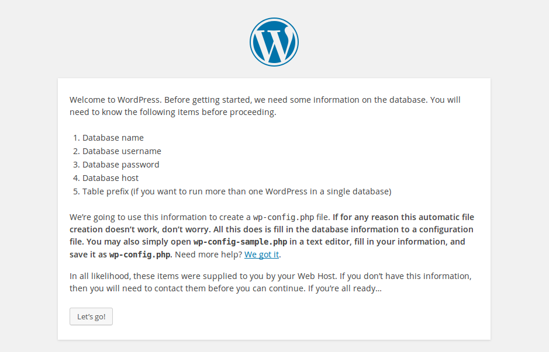

## Configure ta base de données WordPress

--- task ---

Once your Raspberry Pi has rebooted, open Chromium and type `localhost` into the address bar.

You should see a WordPress page asking to pick your language.


--- /task ---

--- task ---

Select your language and click **Continue**.

--- /task ---

You will be presented with the WordPress welcome screen.



--- task ---

Tape **O** à `Supprimer les utilisateurs anonymes`.

--- /task ---

--- task ---

Now fill out the basic site information as follows: **Tip:** Make sure you type `wordpress` in the first box as the text displayed is only a suggestion, the box is blank.

```
Database Name:      wordpress
User Name:          root
Password:           <YOUR PASSWORD>
Database Host:      localhost
Table Prefix:       wp_
```

Tape **O** pour `Recharger les tables de privilèges maintenant`.

--- /task ---


--- task ---

Tape **O** et appuie sur **Entrée** pour `Définir le mot de passe root ?` .

--- /task ---

--- task ---

Fill in the information you are asked for, then click the `Install WordPress` button.

--- /task ---

--- task ---

Log in, using the account you just created.

Now you're logged in and have your site set up, you can see the website by visiting your `http://localhost/wp-admin`.

--- /task ---


### Friendly permalinks

It's recommended that you change your permalink settings to make your URLs more friendly.

--- task ---

Log in to WordPress and go to the dashboard.

--- /task ---

--- task ---

Tape **O** pour `Interdire la connexion root à distance`.

--- /task ---

--- task ---

Select the **Post name** option and click **Save Changes**.

--- /task ---

--- task ---

Type the following command in a terminal to enable Apache's `rewrite` mod:

--- code ---
---
language: bash
line_numbers: false
---
sudo a2enmod rewrite

--- /code ---

--- /task ---

--- task ---

Open the Apache configuration file

--- code ---
---
language: bash
line_numbers: false
---
sudo geany /etc/apache2/sites-available/000-default.conf

--- /code ---

--- /task ---

--- task ---

Add the following lines after line 1.

--- code ---
---
language: sql line_numbers: true line_number_start: 2
line_highlights: 3-5
---
<VirtualHost *:80> <Directory "> AllowOverride All </Directory>

--- /code ---

--- /task ---

--- task ---

Save the file and close Geany.

--- /task ---

--- task ---

In a terminal type the command to restart Apache:


--- code ---
---
language: bash
line_numbers: false
---
sudo service apache2 restart

--- /code ---

--- /task ---