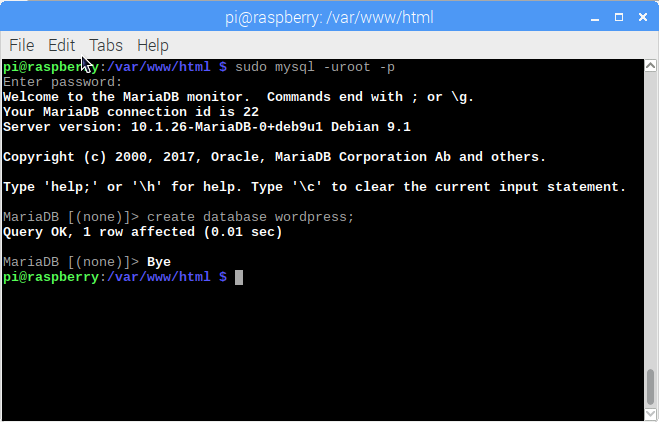

## Configure ta base de données WordPress

#### Configurer MySQL / MariaDB

Pour configurer ton site WordPress, tu as besoin d'une base de données. C'est là qu'interviennent MySQL et MariaDB !

+ Exécute la commande d'installation sécurisée MySQL dans la fenêtre du terminal.

```bash
sudo mysql_secure_installation
```

+ Il te sera demandé `Entrez le mot de passe actuel pour root (entrée pour aucun): ` - appuyez sur ** Entrée**.

+ Tape **O** et appuie sur **Entrée** pour `Définir le mot de passe root ?` .

+ Saisis un mot de passe dans le `Nouveau mot de passe : ` et appuie sur **Entrée**. **Important :** n'oublie pas ce mot de passe root, car tu en auras besoin plus tard pour configurer WordPress.

+ Tape **O** à `Supprimer les utilisateurs anonymes`.

+ Tape **O** pour `Interdire la connexion root à distance`.

+ Tape **O** pour `Supprimer la base de données de test et son accès`.

+ Tape **O** pour `Recharger les tables de privilèges maintenant`.

Une fois terminé, tu verras le message `Tout est fait !` et `Merci d'utiliser MariaDB ! `.

#### Créer la base de données WordPress

+ Exécute `mysql` dans la fenêtre du terminal :

```bash 
sudo mysql -uroot -p
```

+ Saisis le mot de passe root que tu as créé.

Tu seras accueilli par le message `Bienvenue sur le moniteur MariaDB`.

+ Crée la base de données pour ton installation WordPress à l'invite `MariaDB [(none)]>` en utilisant :

```
create database wordpress;
```

  Note le point-virgule terminant l'instruction.

Si cela a réussi, tu devrais voir ceci :

```
Query OK, 1 row affected (0.00 sec)
```



+ Accorde maintenant des privilèges de base de données à l'utilisateur root. **Remarque : ** tu devras saisir ton propre mot de passe après `IDENTIFY BY`.

```
GRANT ALL PRIVILEGES ON wordpress.* TO 'root'@'localhost' IDENTIFIED BY 'YOURPASSWORD';
```

+ Pour que les modifications prennent effet, tu devras vider les privilèges de la base de données :

```
FLUSH PRIVILEGES;
```

+ Exit the MariaDB prompt with <kbd>Ctrl</kbd> + <kbd>D</kbd>.

+ Restart your Raspberry Pi:

```
sudo reboot
```
