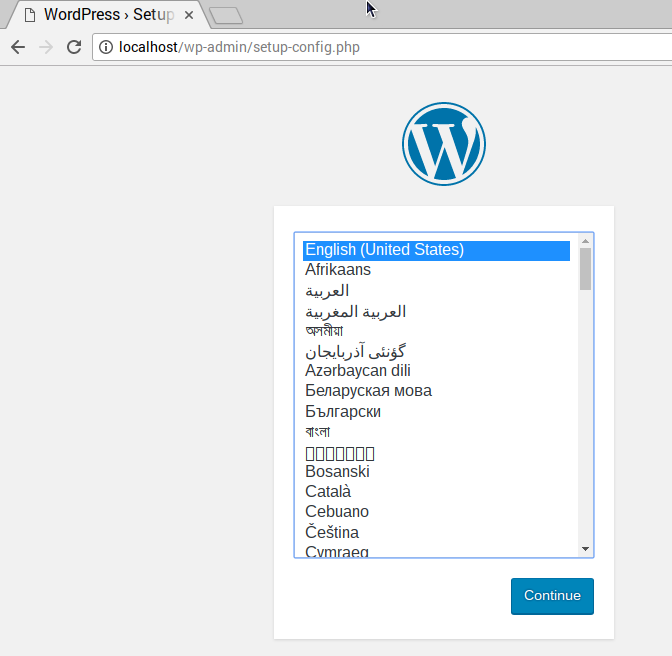
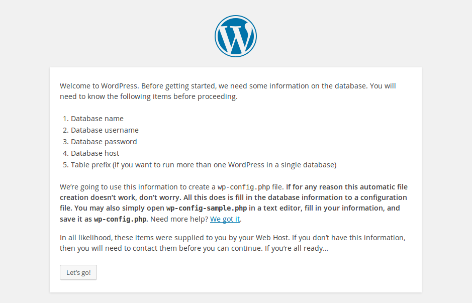
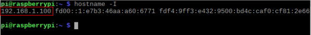

## Configuration de WordPress

+ Ouvre le navigateur Web sur ton Pi et va sur `http://localhost`, tu devrais voir une page WordPress te demandant de choisir ta langue.



+ Sélectionne ta langue et clique sur **Continuer**.

Tu verras apparaître un écran de bienvenue WordPress.



+ Clique sur le bouton **Allons-y !**.

+ Remplis maintenant les informations de base du site comme suit :

```
Database Name:      wordpress
User Name:          root
Password:           <YOUR PASSWORD>
Database Host:      localhost
Table Prefix:       wp_
```

+ Clique sur **Soumettre** pour procéder.

+ Clique sur le bouton **Lancer l'installation**.

Tu te rapproches maintenant !


Remplis les informations : donne un titre à ton site, crée un nom d'utilisateur et un mot de passe, puis entre ton adresse e-mail. Appuie sur `Installer WordPress` puis connecte-toi en utilisant le compte que tu viens de créer.

Maintenant que tu es connecté et que ton site est configuré, tu peux voir le site Web en visitant `http://localhost/wp-admin` .

--- collapse ---

---
title: Connecte-toi à WordPress depuis un autre ordinateur
---

Pour te connecter à partir d'un autre ordinateur, ouvre un navigateur et accède à `http://PI-IP-ADDRESS/wp-admin ` , en utilisant l'adresse IP de ton Pi.

Tu peux trouver l'adresse IP de ton Pi en utilisant cette commande :

```bash
hostname -I
```



--- /collapse ---


### Beaux Permaliens

Il est recommandé de modifier tes paramètres de permalien pour rendre tes URL plus conviviales.

Pour ce faire, connecte-toi à WordPress et accède au tableau de bord.

+ Va sur **Réglage** , puis **Permaliens**.

+ Sélectionne le **Nom du message** et clique sur **Enregistrer les modifications**.

Tu devras activer le mode réécriture `d'Apache` :

```bash
sudo a2enmod rewrite
```

Tu devras également indiquer à l'hôte virtuel qui dessert le site pour autoriser l'écrasement des demandes.

+ Modifie le fichier de configuration Apache pour ton hôte virtuel :

```bash
sudo mousepad /etc/apache2/sites-available/000-default.conf
```

+ Ajoute les lignes suivantes après la ligne 1.

```
<Directory "/var/www/html">
    AllowOverride All
</Directory>
```

- Assure-toi qu'il se trouve dans le `<VirtualHost *:80>` comme ceci :

```
<VirtualHost *:80>
    <Directory "/var/www/html">
        AllowOverride All
    </Directory>
    ...
```

+ Enregistre le fichier et quitte.

+ Redémarre Apache.

```bash
sudo service apache2 restart
```

### Personnalisation

WordPress est très personnalisable. En cliquant sur le nom de ton site dans la bannière WordPress en haut de la page (lorsque tu es connecté, tu seras redirigé vers le tableau de bord). De là, tu peux changer le thème, ajouter des pages et des publications, modifier le menu, ajouter des plugins et bien plus encore. Ceci est juste un avant-goût pour obtenir quelque chose d'intéressant à configurer sur le serveur Web du Raspberry Pi.
