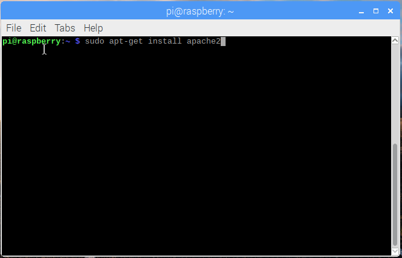

## Configura un server Web Apache

Apache è un web server molto apprezzato che puoi installare su Raspberry Pi per pubblicare pagine web.

Apache, da solo, può pubblicare file HTML statici su protocollo HTTP. Usando moduli aggiuntivi può pubblicare pagine Web dinamiche usando linguaggi di programmazione come PHP.

### Installare Apache

+ Apri una finestra di terminale selezionando **Accessori** > **Terminale** dal menu.

+ Installa il pacchetto `apache2` digitando questo comando nel terminale e premendo <kbd>Invio<kbd>:
</li> </ul> 
  
  <pre><code class="bash"> sudo apt-get install apache2 -y
</code></pre>
  
  

    
  

<h3 spaces-before="0">
  Prova il funzionamento del server web
</h3>

  Apache crea automaticamente un file HTML di prova nella cartella web che potrai visualizzare dal tuo Pi o da un altro computer sulla rete locale.

  Apri la pagina Web predefinita di Apache sul tuo Raspberry Pi:

<ul>
  <li>
    

      Apri Chromium selezionando <strong x-id="1">Internet</strong> > <strong x-id="1">Browser web Chromium</strong> dal menu.
    

  </li>
  <li>
    

      Usa l'indirizzo <code>http://localhost</code>.
    

  </li>
</ul>

  Nella finestra del tuo browser dovrebbe apparire questo:

  <6 />

  Questo significa che Apache funziona!

  Potrai aprire questa pagina Web anche da qualsiasi altro computer della tua rete locale utilizzando l'indirizzo IP di Raspberry Pi, ad esempio <code>http://192.168.1.10</code>.

  Per scoprire l'indirizzo IP del tuo Raspberry Pi, digita <code>nome host -I</code> nella finestra del terminale.  <a href="https://www.raspberrypi.org/documentation/remote-access/ip-address.md">L'indirizzo IP di Raspberry Pi</a> è molto utile e ti permetterà di accedervi da remoto.

<h3 spaces-before="0">
  Modifica la pagina web predefinita
</h3>

  La pagina web predefinita è solo un file HTML nel file system. Si trova nella directory <code>/var/www/html/index.html</code>.

<ul>
  <li>
    Passa a questa directory nel terminale e controlla cosa c'è dentro:
  </li>
</ul>

<pre><code> cd /var/www/html
ls -al
</code></pre>

  Dovresti vedere questo:

<pre><code class="bash">totale 12
drwxr-xr-x 2 root root 4096 gen 8 01:29.
drwxr-xr-x  3 root root 4096 gen  8 01:28 ..
-rw-r - r-- 1 root root 177 8 gen 8 01:29 index.html
</code></pre>

  Questo significa che c'è un file chiamato <code> index.html </code> in <code>/var/www/html/</code>. <code>.</code> si riferisce alla directory stessa <code>/var/www/html</code> e <code>..</code> si riferisce alla directory principale <code>/var/www/ </code>.

<h3 spaces-before="0">
  Che cosa significano le colonne
</h3>

<ol start="1">
  <li>
    I permessi del file o della directory
  </li>
  
  <li>
    Il numero di file nella directory (o <code>1</code> se è un file).
  </li>
  
  <li>
    L'utente proprietario del file o della directory
  </li>
  
  <li>
    Il gruppo proprietario del file o della directory
  </li>
  
  <li>
    La dimensione del file o della directory
  </li>
  
  <li>
    La data e l'ora dell'ultima modifica
  </li>
</ol>

  Come puoi vedere, la directory <code>html</code> e il file <code>index.html</code> sono entrambi di proprietà dell'utente <code>root</code>, quindi avrai bisogno per utilizzare <code>sudo</code> per modificarli.

  Puoi modificare questo file utilizzando mousepad:

<pre><code class="bash">sudo mousepad index.html
</code></pre>

  Se apporti una modifica al file, lo salvi e aggiorni il browser, vedrai apparire la modifica.

