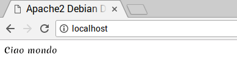

## Installa PHP

PHP è un **preprocessore**: è il codice che viene eseguito quando il server riceve una richiesta per una pagina web tramite un browser web. Stabilisce quello che deve essere mostrato sulla pagina, ed invia la pagina al browser. A differenza dell'HTML statico, PHP può mostrare contenuti diversi in circostanze diverse. Anche altri linguaggi sono in grado di farlo, ma poiché WordPress è scritto in PHP, è quello che dobbiamo usare questa volta. PHP è una linguaggio molto popolare sul web: grandi progetti come Facebook e Wikipedia sono scritti in PHP.

+ Installa il pacchetto PHP con questo comando:

```bash
sudo apt-get install php -y
```

### Prova PHP

+ Crea il file `index.php`:

```bash
sudo mousepad index.php
```

+ Inserisci del contenuto PHP al suo interno:

```php
<? Php echo "ciao mondo"; ?>
```

+ Salva il file.

+ Elimina `index.html`, perché ha la precedenza su `index.php`:

```bash
sudo rm index.html
```

Aggiorna il tuo browser. Dovresti vedere "ciao mondo". Questa pagina non è dinamica, ma è comunque servita da PHP.



Se vedi il codice sorgente PHP invece di "ciao mondo", ricarica e riavvia Apache in questo modo:

```bash
sudo service apache2 restart
```

+ Modifica `index.php` per aggiungere alcuni contenuti dinamici, ad esempio:

```php
<?php echo date('Y-m-d H:i:s'); ?>
```

Oppure puoi mostrare le informazione di configurazione di PHP:

```php
<?php phpinfo(); ?>
```
