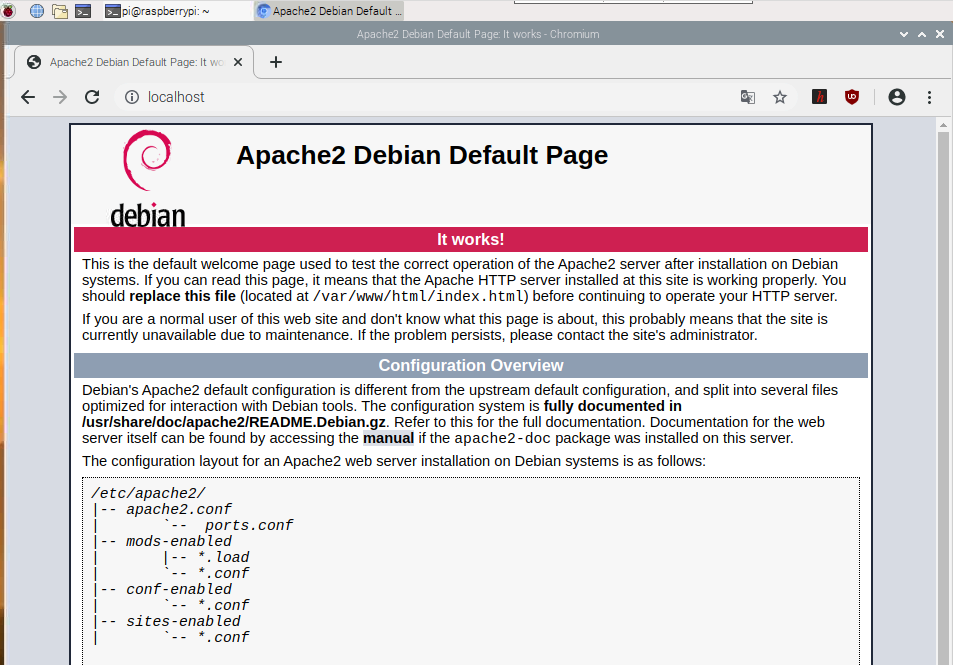

## Stel een Apache-webserver in

Apache is een populaire webserver-applicatie die je op de Raspberry Pi kunt installeren om webpagina's te kunnen weergeven.

Op zichzelf kan Apache HTML-bestanden via HTTP doorgeven. Met extra modules kan het dynamische webpagina's doorgeven met scripttalen zoals PHP.

### Installeer Apache

+ Open een terminalvenster door **Hulpmiddelen** > **Terminal** te selecteren in het menu.

+ Installeer het `apache2` pakket door de volgende opdracht in de terminal te typen en op <kbd>Enter<kbd> te drukken:
</li> </ul> 
  
  <pre><code class="bash">sudo apt-get install apache2 -y
</code></pre>
  
  

    
  

<h3 spaces-before="0">
  Test de webserver
</h3>

  Apache plaatst standaard een HTML-testbestand in de webmap die je vanaf je Pi of een andere computer in je netwerk kunt bekijken.

  Open de standaard Apache-webpagina op je Raspberry Pi:

<ul>
  <li>
    

      Open Chromium door <strong x-id="1">Internet</strong> > <strong x-id="1">Chromium Web Browser</strong> te selecteren in het menu.
    

  </li>
  <li>
    

      Voer het adres <code>http://localhost</code> in.
    

  </li>
</ul>

  Je zou dit in je browservenster moeten zien:

  

  Dit betekent dat Apache werkt!

  Je kunt deze webpagina ook vanaf elke andere computer in je netwerk openen met het IP-adres van je Raspberry Pi, bijvoorbeeld <code>http://192.168.1.10</code>.

  Typ <code>hostname -I</code> in het terminalvenster om het IP-adres van je Raspberry Pi te achterhalen.  Het <a href="https://www.raspberrypi.org/documentation/remote-access/ip-address.md">IP-adres</a> van je Raspberry Pi is erg handig en stelt je in staat om er op afstand toegang toe te krijgen.

<h3 spaces-before="0">
  De standaard webpagina wijzigen
</h3>

  Deze standaard webpagina is slechts een HTML-bestand op het bestandssysteem. Deze bevindt zich op <code>/var/www/html/index.html</code>.

<ul>
  <li>
    Navigeer naar deze map in de terminal en kijk wat erin zit:
  </li>
</ul>

<pre><code>cd /var/www/html
ls -al
</code></pre>

  Je zou dit in het venster moeten zien:

<pre><code class="bash">total 12
drwxr-xr-x 2 root root 4096 8 januari 01:29.
drwxr-xr-x  3 root root 4096 Jan  8 01:28 ..
-rw-r--r--  1 root root  177 Jan  8 01:29 index.html
</code></pre>

  Dit laat zien dat er één bestand is in <code>/var/www/html/</code> genaamd <code>index.html</code>. <code>.</code> refers to the directory itself <code>/var/www/html</code>, and <code>..</code> refers to the parent directory <code>/var/www/</code>.

<h3 spaces-before="0">
  What the columns mean
</h3>

<ol start="1">
  <li>
    The permissions of the file or directory
  </li>
  
  <li>
    The number of files in the directory (or <code>1</code> if it's a file).
  </li>
  
  <li>
    The user that owns the file or directory
  </li>
  
  <li>
    The group that owns the file or directory
  </li>
  
  <li>
    The size of the file or directory
  </li>
  
  <li>
    The date and time of the last modification
  </li>
</ol>

  As you can see, the <code>html</code> directory and <code>index.html</code> file are both owned by the <code>root</code> user, so you'll need to use <code>sudo</code> to edit them.

  You can edit this file using mousepad:

<pre><code class="bash">sudo mousepad index.html
</code></pre>

  If you make a change to the file, save it, and refresh the browser, you will see your change appear.

