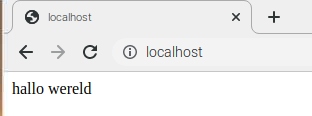

## Installeer PHP

PHP is een **pre-processor**: het is code die wordt uitgevoerd wanneer de server een verzoek voor een webpagina ontvangt via een webbrowser. Het zoekt uit wat er op de pagina moet worden weergegeven en stuurt die pagina vervolgens naar de browser. In tegenstelling tot statische HTML, kan PHP onder verschillende omstandigheden verschillende inhoud weergeven. Andere talen kunnen dit ook, maar aangezien WordPress in PHP is geschreven, is dat wat we deze keer moeten gebruiken. PHP is een zeer populaire taal op internet: grote projecten zoals Facebook en Wikipedia zijn geschreven in PHP.

+ Installeer het PHP-pakket met de volgende opdracht:

```bash
sudo apt-get install php -y
```

### Test PHP

+ Maak het bestand `index.php`:

```bash
sudo mousepad index.php
```

+ Zet er wat PHP-inhoud in:

```php
<?php echo "hallo wereld"; ?>
```

+ Sla het bestand op.

+ Verwijder `index.html` omdat het voorrang heeft op `index.php`:

```bash
sudo rm index.html
```

Ververs je browser. Je zou "hallo wereld" moeten zien. Deze pagina is niet dynamisch, maar wordt nog steeds doorgegeven door PHP.



Als je de onbewerkte PHP hierboven ziet in plaats van "hallo wereld", herlaad en herstart Apache als volgt:

```bash
sudo service apache2 restart
```

+ Bewerk `index.php` om wat dynamische inhoud op te nemen, bijvoorbeeld:

```php
<?php echo date('Y-m-d H:i:s'); ?>
```

Of toon je PHP-info:

```php
<?php phpinfo(); ?>
```
