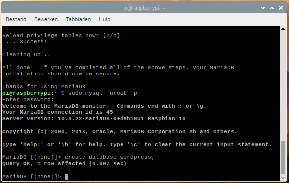

## Stel je WordPress-database in

#### Stel MySQL/MariaDB in

Om je WordPress-site in te stellen, heb je een database nodig. Dit is waar MySQL en MariaDB voor gebruikt worden!

+ Voer de MySQL veilige installatieopdracht uit in het terminalvenster.

```bash
sudo mysql_secure_installation
```

+ Je wordt gevraagd `Enter current password for root (enter for none):` — druk op **Enter**.

+ Typ **Y** en druk op **Enter** voor `Set root password?`.

+ Voer een wachtwoord in bij de `New password:` prompt en druk op **Enter**. **Belangrijk:** onthoud dit root-wachtwoord, omdat je het later nodig hebt om WordPress in te stellen.

+ Typ **Y** voor `Remove anonymous users`.

+ Typ **Y** voor `Disallow root login remotely`.

+ Typ **Y** voor `Remove test database and access to it`.

+ Typ **Y** voor `Reload privilege tables now`.

Als je klaar bent, zie je het bericht `All done!` en `Thanks for using MariaDB!`.

#### Maak de WordPress-database

+ Voer `mysql` uit in het terminalvenster:

```bash 
sudo mysql -uroot -p
```

+ Voer het root-wachtwoord in dat je hebt gemaakt.

Je wordt begroet met het bericht `Welcome to the MariaDB monitor`.

+ Maak de database voor je WordPress-installatie op de `MariaDB [(none)]>` prompt met:

```
create database wordpress;
```

  Let op de puntkomma die de instructie beëindigt.

Als dit is gelukt, zou je dit moeten zien:

```
Query OK, 1 row affected (0.000 sec)
```



+ Verleen nu databaseprivileges aan de root-gebruiker. **Opmerking:** je moet je eigen wachtwoord invoeren na `IDENTIFIED BY`.

```
GRANT ALL PRIVILEGES ON wordpress.* TO 'root'@'localhost' IDENTIFIED BY 'YOURPASSWORD';
```

+ Om de wijzigingen door te voeren, moet je de databasemachtigingen opschonen:

```
FLUSH PRIVILEGES;
```

+ Verlaat de MariaDB-prompt met <kbd>Ctrl</kbd> + <kbd>D</kbd>.

+ Herstart je Raspberry Pi opnieuw op:

```
sudo reboot
```
