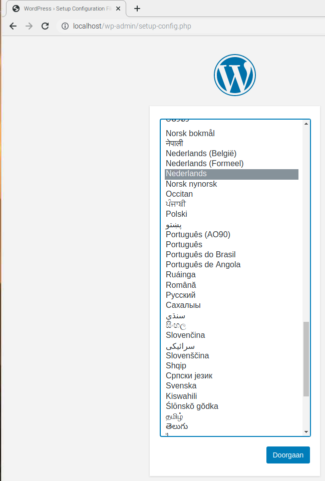
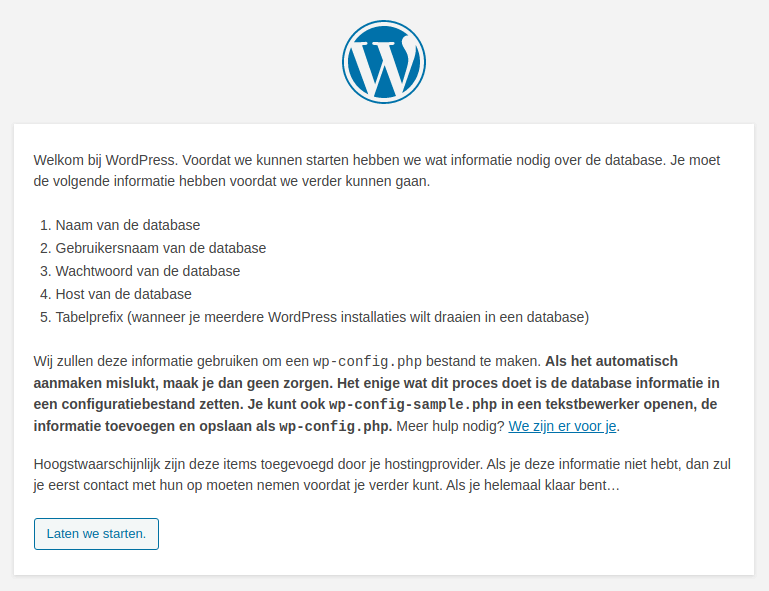
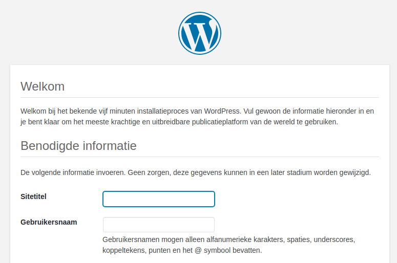

## WordPress-configuratie

+ Open de webbrowser op je Pi en ga naar `http://localhost`, je zou een WordPress-pagina moeten zien waarin je wordt gevraagd je taal te kiezen.



+ Selecteer je taal en klik op **Doorgaan**.

Je krijgt het welkomscherm van WordPress te zien.



+ Klik op de **Laten we starten.** knop.

+ Vul nu de basissite-informatie als volgt in:

```
Databasenaam: wordpress
Gebruikersnaam: root
Wachtwoord: <YOUR PASSWORD>
Hostnaam: localhost
Tabelprefix: wp_
```

+ Klik op **Verzenden** om verder te gaan.

+ Klik op de **Installatie uitvoeren** knop.

Je bent er bijna!



Vul de informatie in: geef je site een titel, maak een gebruikersnaam en wachtwoord aan en voer je e-mailadres in. Druk op de `WordPress installeren` knop en log vervolgens in met het account dat je zojuist hebt gemaakt.

Nu je bent ingelogd en je site is opgezet, kun je de website bekijken door naar je `http://localhost/wp-admin` te gaan.

--- collapse ---

---
title: Log in op WordPress vanaf een andere computer
---

Om in te loggen vanaf een andere computer, open een browser en ga naar `http://PI-IP-ADDRESS/wp-admin`, met behulp van het IP-adres van je Pi.

Je kunt het IP-adres van je Pi vinden met behulp van deze opdracht:

```bash
hostname -I
```


--- /collapse ---


### Vriendelijke permalinks

Het wordt aanbevolen dat je je permalink-instellingen wijzigt om je URL's vriendelijker te maken.

Log hiervoor in op WordPress en ga naar het dashboard.

+ Ga naar **Instellingen** en vervolgens **Permalinks**.

+ Selecteer de **Berichtnaam** optie en klik op **Wijzigingen opslaan**.

Je moet Apache's `rewrite` mod inschakelen:

```bash
sudo a2enmod rewrite
```

Je moet ook de virtuele host die de site bedient vertellen dat verzoeken kunnen worden overschreven.

+ Bewerk het Apache-configuratiebestand voor je virtuele host:

```bash
sudo mousepad /etc/apache2/sites-available/000-default.conf
```

+ Voeg de volgende regels toe na regel 1.

```
<Directory "/var/www/html">
    AllowOverride All
</Directory>
```

- Zorg ervoor dat het binnen de `<VirtualHost *:80>` valt, zoals:

```
<VirtualHost *:80>
    <Directory "/var/www/html">
        AllowOverride All
    </Directory>
    ...
```

+ Sla het bestand op en sluit af.

+ Start Apache opnieuw.

```bash
sudo service apache2 restart
```

### Maatwerk

WordPress is zeer aanpasbaar. Door op je sitenaam te klikken in de WordPress-banner bovenaan de pagina (wanneer je bent ingelogd) word je naar het dashboard geleid. Van daaruit kun je het thema wijzigen, pagina's en berichten toevoegen, het menu bewerken, plug-ins toevoegen en nog veel meer. Dit is slechts een voorproefje om iets interessants op de webserver van de Raspberry Pi te installeren.
