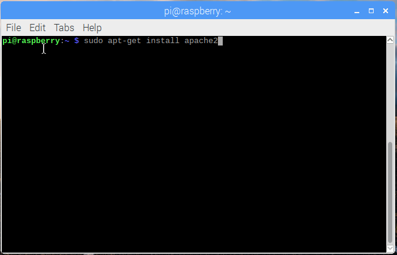

## Skonfiguruj serwer stron www oparty na Apache

Apache to popularny serwer stron www, który można zainstalować na Raspberry Pi, aby umożliwić obsługę stron internetowych.

Samodzielnie Apache może obsługiwać pliki HTML przez HTTP. Dzięki dodatkowym modułom może obsługiwać dynamiczne strony internetowe przy użyciu języków skryptowych, takich jak PHP.

### Zainstaluj Apache

+ Otwórz okno terminala, wybierając **Akcesoria** > **Terminal** z menu.

+ Zainstaluj pakiet `apache2`, wpisując następujące polecenie w terminalu i naciskając <kbd>Enter<kbd>: 
</li> </ul> 
  
  <pre><code class="bash">sudo apt-get install apache2 -y
</code></pre>
  
  

    
  

<h3 spaces-before="0">
  Przetestuj serwer stron www
</h3>

  Domyślnie Apache umieszcza testowy plik HTML w folderze stron internetowych, który będzie można przeglądać z poziomu Pi lub innego komputera w sieci.

  Otwórz domyślną stronę internetową Apache na swoim Raspberry Pi:

<ul>
  <li>
    

      Otwórz Chromium wybierając <strong x-id="1">Internet</strong> > <strong x-id="1">Przeglądarka internetowa Chromium</strong> z menu.
    

  </li>
  <li>
    

      Wpisz adres <code>http://localhost</code>.
    

  </li>
</ul>

  Powinnaś zobaczyć to w oknie przeglądarki:

  

  Oznacza to, że masz działający serwer Apache!

  Będziesz także mogła otworzyć tę stronę internetową z dowolnego komputera w twojej sieci używając adresu IP swojego Raspberry Pi, np. <code>http://192.168.1.10</code>.

  Aby znaleźć adres IP Raspberry Pi, wpisz <code>hostname -I</code> w oknie terminala.  <a href="https://www.raspberrypi.org/documentation/remote-access/ip-address.md">Adres IP</a> twojego Raspberry Pi jest naprawdę przydatny i umożliwia zdalny dostęp do niego.

<h3 spaces-before="0">
  Zmiana domyślnej strony internetowej
</h3>

  Ta domyślna strona internetowa to tylko plik HTML w systemie plików. Plik ten znajduje się w ścieżce <code>/var/www/html/index.html</code>.

<ul>
  <li>
    Przejdź do tego katalogu w terminalu i zobacz, co jest w środku:
  </li>
</ul>

<pre><code>cd /var/www/html
ls -al
</code></pre>

  Powinnaś zobaczyć to w oknie:

<pre><code class="bash">łącznie 12
drwxr-xr-x  2 root root 4096 Jan  8 01:29 .
drwxr-xr-x  3 root root 4096 Jan  8 01:28 ..
-rw-r--r--  1 root root  177 Jan  8 01:29 index.html
</code></pre>

  To pokazuje, że jest jeden plik w katalogu <code>/var/www/html/</code> o nazwie <code>index.html</code>. <code>.</code> refers to the directory itself <code>/var/www/html</code>, and <code>..</code> refers to the parent directory <code>/var/www/</code>.

<h3 spaces-before="0">
  What the columns mean
</h3>

<ol start="1">
  <li>
    The permissions of the file or directory
  </li>
  
  <li>
    The number of files in the directory (or <code>1</code> if it's a file).
  </li>
  
  <li>
    The user that owns the file or directory
  </li>
  
  <li>
    The group that owns the file or directory
  </li>
  
  <li>
    The size of the file or directory
  </li>
  
  <li>
    The date and time of the last modification
  </li>
</ol>

  As you can see, the <code>html</code> directory and <code>index.html</code> file are both owned by the <code>root</code> user, so you'll need to use <code>sudo</code> to edit them.

  You can edit this file using mousepad:

<pre><code class="bash">sudo mousepad index.html
</code></pre>

  If you make a change to the file, save it, and refresh the browser, you will see your change appear.

