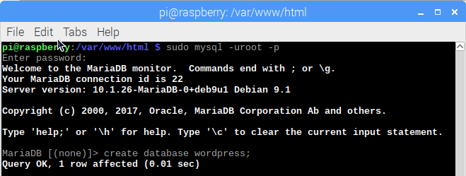

## Skonfiguruj bazę danych WordPress

#### Skonfiguruj MySQL/MariaDB

Aby skonfigurować stronę WordPress, potrzebujesz bazy danych. Tutaj właśnie pojawiają się MySQL i MariaDB!

+ Uruchom polecenie bezpiecznej instalacji MySQL w oknie terminala.

```bash
sudo mysql_secure_installation
```

+ Zostaniesz poproszony `wpisanie obecnego hasła dla użytkownika root (wciśnij enter jeśli brak hasła):` - naciśnij **Enter**.

+ Wpisz **Y** i naciśnij **Enter** jako odpowiedź na pytanie `Set root password?` (Ustawić hasło roota?).

+ Wpisz hasło w okienku gdzie jest napisane `New password:` (Nowe hasło) i naciśnij **Enter**. **Ważne:** zapamiętaj to hasło roota, ponieważ będzie ono potrzebne później, aby skonfigurować WordPress.

+ Wpisz **Y** jako odpowiedź na `Remove anonymous users` (usuń anonimowych użytkowników).

+ Wpisz **Y** jako odpowiedź na `Disallow root login remotely` (odmawiaj dostępu zdalnego dla użytkownika root).

+ Wpisz **Y** jako odpowiedź na `Remove test database and access to it` (Usuń testową bazę danych i dostęp do niej).

+ Wpisz **Y** jako odpowiedź na `Reload privilege tables now` (przeładuj tabele uprzywilejowane teraz).

Po zakończeniu zobaczysz komunikat `All done!` (Wszystko gotowe!) oraz `Thanks for using MariaDB!` (Dziękujemy za korzystanie z MariaDB).

#### Utwórz bazę danych WordPress

+ Uruchom `mysql` w oknie terminala:

```bash 
sudo mysql -uroot -p
```

+ Wprowadź hasło roota, które utworzyłaś.

Zostaniesz powitana wiadomością `Welcome to the MariaDB monitor` (Witaj w monitorze MariaDB).

+ Utwórz bazę danych dla instalacji WordPress w wierszu poleceń `MariaDB [(none)]>` za pomocą polecenia:

```
create database wordpress;
```

  Zwróć uwagę na średnik kończący instrukcję.

Jeśli to się powiedzie, powinieneś zobaczyć to:

```
Query OK, 1 row affected (0.00 sec)
```



+ Teraz nadaj uprawnienia do bazy danych użytkownikowi root. **Uwaga:** musisz wprowadzić własne hasło po `IDENTIFIED BY`.

```
GRANT ALL PRIVILEGES ON wordpress.* TO 'root'@'localhost' IDENTIFIED BY 'TWOJEHASLO';
```

+ Aby zmiany weszły w życie, musisz opróżnić uprawnienia bazy danych:

```
FLUSH PRIVILEGES;
```

+ Wyjdź z wiersza poleceń MariaDB za pomocą <kbd>Ctrl</kbd> + <kbd>D</kbd>.

+ Uruchom ponownie swoje Raspberry Pi:

```
sudo reboot
```
