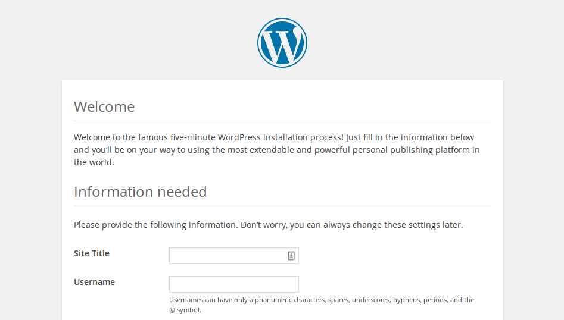

## Konfiguracja WordPress

+ Otwórz przeglądarkę internetową na swoim Pi i przejdź do `http://localhost`, powinnaś zobaczyć stronę WordPress z prośbą o wybranie języka.


+ Wybierz język i kliknij **Continue**.

Zostanie wyświetlony ekran powitalny WordPress.


+ Kliknij przycisk **Let's go!** (zaczynajmy).

+ Teraz wypełnij podstawowe informacje o stronie w następujący sposób:

```
Database Name:      wordpress
User Name:          root
Password:           <YOUR PASSWORD>
Database Host:      localhost
Table Prefix:       wp_
```

+ Kliknij **Submit** (Prześlij), żeby przejść dalej.

+ Kliknij przycisk **Run the install** (uruchom instalator).

Jesteś już blisko!



Podaj informacje: nadaj swojej witrynie tytuł, stwórz nazwę użytkownika i hasło oraz wprowadź swój adres e-mail. Kliknij przycisk `Install WordPress` (zainstaluj Wordpress), a następnie zaloguj się przy użyciu właśnie utworzonego konta.

Po zalogowaniu się i skonfigurowaniu witryny można ją wyświetlić, odwiedzając stronę `http://localhost/wp-admin`.

--- collapse ---

---
title: Zaloguj się do WordPress z innego komputera
---

Aby zalogować się z innego komputera, otwórz przeglądarkę i przejdź do `http://ADRES-IP-PI/wp-admin`, używając adresu IP twojego Pi.

Możesz znaleźć adres IP swojego Pi, używając tego polecenia:

```bash
hostname -I
```


--- /collapse ---


### Przyjazne linki bezpośrednie

Zaleca się zmianę ustawień linku bezpośredniego, aby adresy URL były bardziej przyjazne.

Aby to zrobić, zaloguj się do WordPress i przejdź do pulpitu.

+ Przejdź do **Setting** (Ustawienia), a następnie **Permalinks** (linki bezpośrednie).

+ Wybierz opcję **Post name** (nazwa wpisu) i kliknij **Save Changes** (zapisz zmiany).

Musisz włączyć mod `rewrite` (przepisywania) Apache:

```bash
sudo a2enmod rewrite
```

Musisz także poinformować wirtualnego hosta obsługującego witrynę, aby zezwalał na zastępowanie żądań.

+ Edytuj plik konfiguracyjny Apache dla wirtualnego hosta:

```bash
sudo mousepad /etc/apache2/sites-available/000-default.conf
```

+ Dodaj następujące wiersze po wierszu 1.

```
<Directory "/var/www/html">
    AllowOverride All
</Directory>
```

- Upewnij się, że jest zawarty pomiędzy `<VirtualHost *:80>` w następujący sposób:

```
<VirtualHost *:80>
    <Directory "/var/www/html">
        AllowOverride All
    </Directory>
    ...
```

+ Zapisz plik i wyjdź.

+ Uruchom ponownie Apache.

```bash
sudo service apache2 restart
```

### Dostosowywanie

WordPress jest bardzo konfigurowalny. Klikając nazwę swojej witryny w banerze WordPress u góry strony (po zalogowaniu się, jesteś przeniesiony do pulpitu nawigacyjnego). Stamtąd możesz zmienić motyw, dodawać strony i posty, edytować menu, dodawać wtyczki i wiele więcej. To tylko próbka skonfigurowania czegoś interesującego na serwerze stron www działającym na Raspberry Pi.
