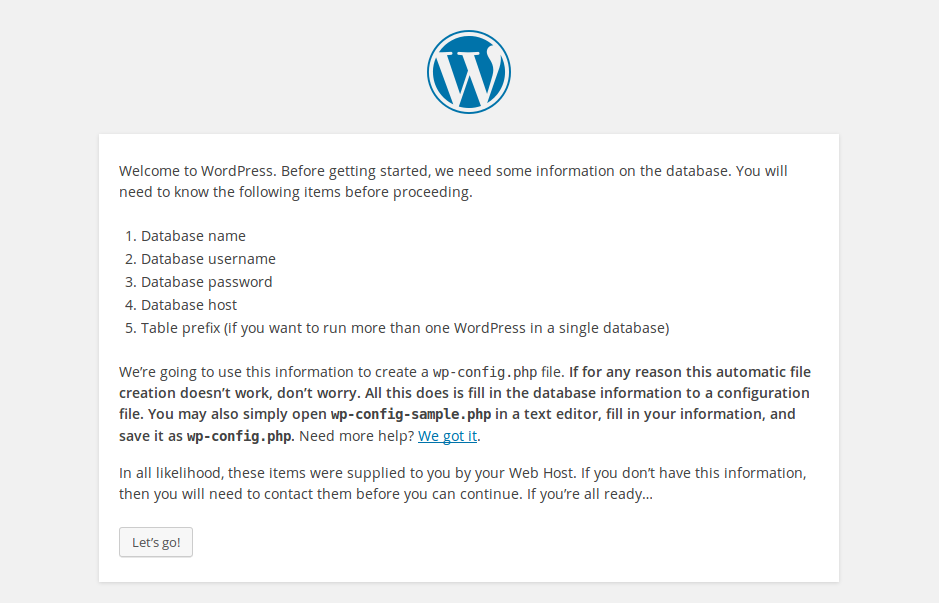
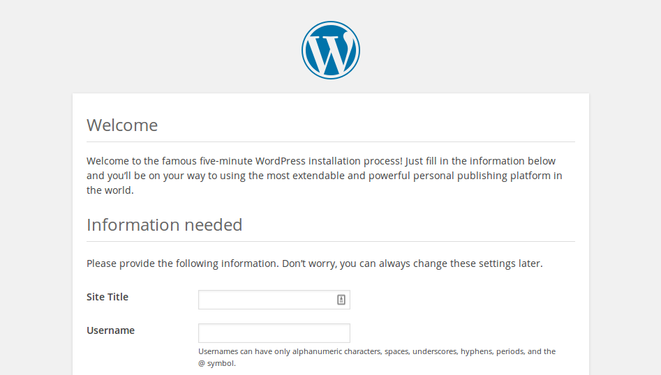

## WordPress configuration

+ Open the web browser on your Pi and goto `http://localhost`, you should see a WordPress page asking to pick your language.


+ Select your language and click **Continue**.

You will be presented with the WordPress welcome screen.



+ Click the **Let's go!** button.

+ Now fill out the basic site information as follows:

```
Database Name:      wordpress
User Name:          root
Password:           <YOUR PASSWORD>
Database Host:      localhost
Table Prefix:       wp_
```

+ Click **Submit** to proceed.

+ Click the **Run the install** button.

Now you're getting close!



Fill out the information: give your site a title, create a username and password, and enter your email address. Hit the `Install WordPress` button, then log in using the account you just created.

Now you're logged in and have your site set up, you can see the website by visiting your `http://localhost/wp-admin`.

--- collapse ---

---
title: Log in to WordPress from another computer
---

To log in from another computer, open a browser and go to `http://PI-IP-ADDRESS/wp-admin`, using your Pi's IP address.

You can find your Pi's IP address using this command:

```bash
hostname -I
```


--- /collapse ---


### Friendly permalinks

It's recommended that you change your permalink settings to make your URLs more friendly.

To do this, log in to WordPress and go to the dashboard.

+ Go to **Setting**, then **Permalinks**.

+ Select the **Post name** option and click **Save Changes**.

You'll need to enable Apache's `rewrite` mod:

```bash
sudo a2enmod rewrite
```

You'll also need to tell the virtual host serving the site to allow requests to be overwritten.

+ Edit the Apache configuration file for your virtual host:

```bash
sudo leafpad /etc/apache2/sites-available/000-default.conf
```

+ Add the following lines after line 1.

```
<Directory "/var/www/html">
    AllowOverride All
</Directory>
```

- Ensure it's within the `<VirtualHost *:80>` like so:

```
<VirtualHost *:80>
    <Directory "/var/www/html">
        AllowOverride All
    </Directory>
    ...
```

+ Save the file and exit.

+ Restart Apache.

```bash
sudo service apache2 restart
```

### Customisation

WordPress is very customisable. By clicking your site name in the WordPress banner at the top of the page (when logged you're in), you'll be taken to the Dashboard. From there, you can change the theme, add pages and posts, edit the menu, add plugins, and lots more. This is just a taster for getting something interesting set up on the Raspberry Pi's web server.
